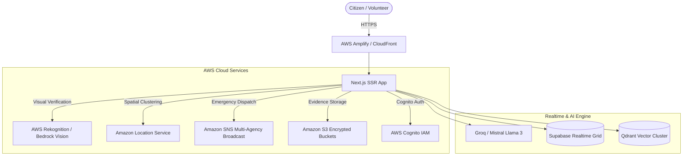

# 🌐 VANNATE AI — Autonomous Humanitarian OS & Civic Emergency Grid

[](#aws-architecture)
[](#tech-stack)
[](#tech-stack)
[](#)
[](#creator)

> **Event:** First Commit | Bharat Builds Tour | WeMakeDevs (AWS Track)  
> **Solo Architect & Developer:** **Soumoditya Das** (Fullstack Shinobi)  
> **Vision:** Transforming disaster response, civic rescue, and humanitarian transparency into an autonomous, zero-latency emergency grid.

---

## 🚨 The Critical Problem We Solve

In moments of crisis—earthquakes, flash floods, medical emergencies, or urban accidents—every second lost costs human lives:
1. **Response Delays:** Citizens dial overloaded helplines with no live status, leading to panic and blind dispatches.
2. **Prank & Fake Reports:** Up to 40% of emergency calls and crowd-sourced alerts are false alarms or recycled photos, wasting critical first-responder bandwidth.
3. **Information Silos:** Police, Fire, Ambulance, and NGOs operate on disconnected frequencies with zero unified situational awareness.
4. **Blood Shortage Panic:** Emergency blood requests still rely on unstructured WhatsApp forwards without real-time donor geocoding.
5. **Humanitarian Trust Deficit:** Donors have no transparent visibility into whether their relief money ever reached the ground.

---

## ⚡ The Solution: VANNATE AI

**VANNATE** is India's first **Autonomous Humanitarian Operating System & Civic Emergency Grid**. It combines hyper-priority citizen reporting, AI-driven anti-prank verification, multi-agency spatial telemetry, and gamified civic rewards into a unified high-performance platform.

### 🌟 Core Modules & Innovation

| Module | Route | What It Does |
|---|---|---|
| 🚨 **CivicLens SOS Command** | `/crisis` | 1-tap hyper-priority emergency broadcast with live GPS extraction and zero-latency first-responder alert. |
| 🛡️ **AI Anti-Prank Camera** | `/crisis`, `/verify` | Real-time computer vision verification powered by **AWS Rekognition / Bedrock Vision** that validates disaster authenticity and filters fake/AI photos. |
| 📍 **Smart Incident Clustering** | `/crisis`, `/dashboard` | Spatial clustering algorithms that aggregate hundreds of duplicate citizen reports into singular crisis hotspots. |
| 🩸 **Emergency Blood Grid** | `/blood` | Real-time blood matching network pairing verified donors with critical patients in under 60 seconds. |
| 📦 **Immutable Fund Tracker** | `/track/[id]` | Transparent 5-stage live checkpoint tracking showing exactly where every rupee of relief fund travels. |
| 🏆 **Dharma & Karma Rewards** | `/rewards` | Gamification engine awarding civic badges, real-world tree planting certificates, and donor impact milestones. |
| 🧑‍🚒 **Volunteer & NGO Field Ops** | `/volunteer`, `/dashboard` | Field responder portal with live telemetry routing, triage management, and NGO Darpan verification. |
| 💬 **Vanna AI Voice Copilot** | Global Floating Widget | Multi-lingual conversational AI assistant guiding panicking citizens through emergency procedures. |

---

## ☁️ AWS Cloud Architecture

Vannate AI is engineered specifically to harness the breadth and reliability of Amazon Web Services:



- **AWS Amplify Hosting:** Zero-maintenance global edge deployment with automated continuous integration.
- **AWS Bedrock & Rekognition:** AI Vision analysis to detect fire, flood, structural collapse, and flag digitally manipulated prank uploads.
- **Amazon Location Service:** High-precision reverse geocoding, multi-agency routing telemetry, and incident heatmap clustering.
- **Amazon SNS:** Instant SMS and push notifications to emergency dispatchers and nearest volunteer rescue units.
- **Amazon S3:** Cryptographically hashed image storage ensuring chain-of-custody for civic reports.

---

## 🎨 Design & Craftsmanship

- **Cyber-Humanitarian Aesthetic:** Tailored dark-mode glassmorphism designed with custom CSS tokens, frosted glass backdrop filters, and subtle ambient glows.
- **Micro-Animations:** Fluid layout transitions, spring physics, and telemetry animations powered by `framer-motion`.
- **Interactive 3D Engine:** Immersive 3D wireframe globe and starfield rendered using Three.js and `@react-three/fiber`.
- **Zero-Latency State:** Optimistic UI updates with real-time sync across devices.

---

## 🛠️ Tech Stack

- **Framework:** Next.js 14.2 (App Router, Server-Side Rendering)
- **Language:** TypeScript
- **Styling:** Tailwind CSS + Custom CSS Design System
- **3D Graphics:** Three.js, React Three Fiber, React Three Drei
- **Realtime Database:** Supabase Realtime, Firebase Firestore
- **Vector Search:** Qdrant Cloud (AWS US-East-2 Cluster)
- **AI Models:** AWS Bedrock, Groq (Llama-3-70B), Mistral AI, Sarvam AI, ElevenLabs Voice
- **Payments:** Razorpay, Stripe

---

## 🚀 Quick Start Guide

### Prerequisites
- Node.js 18.x or 20.x
- npm or pnpm

### Installation

```bash
# Clone the repository
git clone https://github.com/soumoditt-source/VANNATE_THE_OS_FULLSTACK_SHINOBI_SOUMODITYA-DAS.git

# Enter project directory
cd VANNATE_THE_OS_FULLSTACK_SHINOBI_SOUMODITYA-DAS

# Install dependencies
npm install --legacy-peer-deps

# Run local development server
npm run dev
```

Visit `http://localhost:3000` in your browser.

---

## 🌐 Deploying to AWS Amplify (1-Click)

1. Fork or push this repository to your GitHub account.
2. Go to the [AWS Management Console](https://console.aws.amazon.com/amplify).
3. Click **Deploy an app** -> Select **GitHub**.
4. Select repository `soumoditt-source/VANNATE_THE_OS_FULLSTACK_SHINOBI_SOUMODITYA-DAS`.
5. Under **Environment Variables**, paste the keys from `.env.example`.
6. Click **Save and Deploy**. Your live production instance will be ready in under 3 minutes!

---

## 👤 Solo Developer & Creator

**Soumoditya Das** (Fullstack Shinobi)  
- GitHub: [@soumoditt-source](https://github.com/soumoditt-source)  
- Built exclusively and independently for the **AWS Bharat Builds Tour | WeMakeDevs Hackathon**.

---

*“When technology serves humanity, code becomes seva.”*
